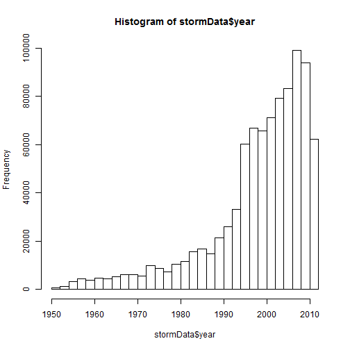

Severe Weather Events: Impact on Public Health and Economy in the United States
========================================================
##### Created by: whatevergeek
##### Created on: 20141126

### Synopsis
This report tries to analyze the impact of different weather events on public health and economy based on the storm database collected from the U.S. National Oceanic and Atmospheric Administration's (NOAA) from 1950 - 2011.Estimates of fatalities, injuries, property and crop damage were used to decide which types of event are most harmful to the population health and economy. Using such data, it was found that excessive heat and tornado are most harmful with respect to population health, while flood, drought, and hurricane/typhoon have the greatest economic consequences.


### Code Setup

```r
echo = TRUE  
options(scipen = 1) 
library(R.utils)
```

```
## Warning: package 'R.utils' was built under R version 3.1.2
```

```
## Loading required package: R.oo
```

```
## Warning: package 'R.oo' was built under R version 3.1.2
```

```
## Loading required package: R.methodsS3
```

```
## Warning: package 'R.methodsS3' was built under R version 3.1.2
```

```
## R.methodsS3 v1.6.1 (2014-01-04) successfully loaded. See ?R.methodsS3 for help.
## R.oo v1.18.0 (2014-02-22) successfully loaded. See ?R.oo for help.
## 
## Attaching package: 'R.oo'
## 
## The following objects are masked from 'package:methods':
## 
##     getClasses, getMethods
## 
## The following objects are masked from 'package:base':
## 
##     attach, detach, gc, load, save
## 
## R.utils v1.34.0 (2014-10-07) successfully loaded. See ?R.utils for help.
## 
## Attaching package: 'R.utils'
## 
## The following object is masked from 'package:utils':
## 
##     timestamp
## 
## The following objects are masked from 'package:base':
## 
##     cat, commandArgs, getOption, inherits, isOpen, parse, warnings
```

```r
library(ggplot2)
library(plyr)
library(gridExtra)
```

```
## Warning: package 'gridExtra' was built under R version 3.1.2
```

```
## Loading required package: grid
```

### Data Processing
The following code will unzip and load the data

```r
cache = TRUE
stormData <- read.csv(bzfile("repdata-data-StormData.csv.bz2"))
```

#### Initial data checks and exploration


```r
dim(stormData)
```

```
## [1] 902297     37
```

```r
head(stormData, n = 2)
```

```
##   STATE__          BGN_DATE BGN_TIME TIME_ZONE COUNTY COUNTYNAME STATE
## 1       1 4/18/1950 0:00:00     0130       CST     97     MOBILE    AL
## 2       1 4/18/1950 0:00:00     0145       CST      3    BALDWIN    AL
##    EVTYPE BGN_RANGE BGN_AZI BGN_LOCATI END_DATE END_TIME COUNTY_END
## 1 TORNADO         0                                               0
## 2 TORNADO         0                                               0
##   COUNTYENDN END_RANGE END_AZI END_LOCATI LENGTH WIDTH F MAG FATALITIES
## 1         NA         0                        14   100 3   0          0
## 2         NA         0                         2   150 2   0          0
##   INJURIES PROPDMG PROPDMGEXP CROPDMG CROPDMGEXP WFO STATEOFFIC ZONENAMES
## 1       15    25.0          K       0                                    
## 2        0     2.5          K       0                                    
##   LATITUDE LONGITUDE LATITUDE_E LONGITUDE_ REMARKS REFNUM
## 1     3040      8812       3051       8806              1
## 2     3042      8755          0          0              2
```
The events in the database start in the year 1950 and end in November 2011. In the earlier years, there are generally fewer events recorded, probably due to lack of good records. Recent years would be considered more complete.

```r
if (dim(stormData)[2] == 37) {
    stormData$year <- as.numeric(format(as.Date(stormData$BGN_DATE, format = "%m/%d/%Y %H:%M:%S"), "%Y"))
}
hist(stormData$year, breaks = 30)
```

 

The above histogram shows that the number of events tracked starts to significantly increase around 1995. Subset of the data from 1990 to 2011 was used to get most out of good records.


```r
storm <- stormData[stormData$year >= 1995, ]
dim(storm)
```

```
## [1] 681500     38
```
#### Public Health Impact
This section shows the number of **fatalities** and **injuries** that are caused by the severe weather events. The first 15 most severe types of weather events were taken into consideration.

```r
sortHelper <- function(fieldName, top = 15, dataset = stormData) {
    index <- which(colnames(dataset) == fieldName)
    field <- aggregate(dataset[, index], by = list(dataset$EVTYPE), FUN = "sum")
    names(field) <- c("EVTYPE", fieldName)
    field <- arrange(field, field[, 2], decreasing = T)
    field <- head(field, n = top)
    field <- within(field, EVTYPE <- factor(x = EVTYPE, levels = field$EVTYPE))
    return(field)
}

fatalities <- sortHelper("FATALITIES", dataset = storm)
injuries <- sortHelper("INJURIES", dataset = storm)
```

#### Economy Impact
**property damage** and **crop damage** data will be converted into comparable numerical forms according to the meaning of units described in the code book ([Storm Events](http://ire.org/nicar/database-library/databases/storm-events/)). Both `PROPDMGEXP` and `CROPDMGEXP` columns record a multiplier for each observation which has Hundred (H), Thousand (K), Million (M) and Billion (B).


```r
convertHelper <- function(dataset = storm, fieldName, newFieldName) {
    totalLen <- dim(dataset)[2]
    index <- which(colnames(dataset) == fieldName)
    dataset[, index] <- as.character(dataset[, index])
    logic <- !is.na(toupper(dataset[, index]))
    dataset[logic & toupper(dataset[, index]) == "B", index] <- "9"
    dataset[logic & toupper(dataset[, index]) == "M", index] <- "6"
    dataset[logic & toupper(dataset[, index]) == "K", index] <- "3"
    dataset[logic & toupper(dataset[, index]) == "H", index] <- "2"
    dataset[logic & toupper(dataset[, index]) == "", index] <- "0"
    dataset[, index] <- as.numeric(dataset[, index])
    dataset[is.na(dataset[, index]), index] <- 0
    dataset <- cbind(dataset, dataset[, index - 1] * 10^dataset[, index])
    names(dataset)[totalLen + 1] <- newFieldName
    return(dataset)
}

storm <- convertHelper(storm, "PROPDMGEXP", "propertyDamage")
```

```
## Warning in convertHelper(storm, "PROPDMGEXP", "propertyDamage"): NAs
## introduced by coercion
```

```r
storm <- convertHelper(storm, "CROPDMGEXP", "cropDamage")
```

```
## Warning in convertHelper(storm, "CROPDMGEXP", "cropDamage"): NAs
## introduced by coercion
```

```r
names(storm)
```

```
##  [1] "STATE__"        "BGN_DATE"       "BGN_TIME"       "TIME_ZONE"     
##  [5] "COUNTY"         "COUNTYNAME"     "STATE"          "EVTYPE"        
##  [9] "BGN_RANGE"      "BGN_AZI"        "BGN_LOCATI"     "END_DATE"      
## [13] "END_TIME"       "COUNTY_END"     "COUNTYENDN"     "END_RANGE"     
## [17] "END_AZI"        "END_LOCATI"     "LENGTH"         "WIDTH"         
## [21] "F"              "MAG"            "FATALITIES"     "INJURIES"      
## [25] "PROPDMG"        "PROPDMGEXP"     "CROPDMG"        "CROPDMGEXP"    
## [29] "WFO"            "STATEOFFIC"     "ZONENAMES"      "LATITUDE"      
## [33] "LONGITUDE"      "LATITUDE_E"     "LONGITUDE_"     "REMARKS"       
## [37] "REFNUM"         "year"           "propertyDamage" "cropDamage"
```

```r
options(scipen=999)
property <- sortHelper("propertyDamage", dataset = storm)
crop <- sortHelper("cropDamage", dataset = storm)
```


### Results
For the public health impact, the following shows two sorted lists of severe weather events below by the number of people badly affected.

```r
fatalities
```

```
##               EVTYPE FATALITIES
## 1     EXCESSIVE HEAT       1903
## 2            TORNADO       1545
## 3        FLASH FLOOD        934
## 4               HEAT        924
## 5          LIGHTNING        729
## 6              FLOOD        423
## 7        RIP CURRENT        360
## 8          HIGH WIND        241
## 9          TSTM WIND        241
## 10         AVALANCHE        223
## 11      RIP CURRENTS        204
## 12      WINTER STORM        195
## 13         HEAT WAVE        161
## 14 THUNDERSTORM WIND        131
## 15      EXTREME COLD        126
```

```r
injuries
```

```
##               EVTYPE INJURIES
## 1            TORNADO    21765
## 2              FLOOD     6769
## 3     EXCESSIVE HEAT     6525
## 4          LIGHTNING     4631
## 5          TSTM WIND     3630
## 6               HEAT     2030
## 7        FLASH FLOOD     1734
## 8  THUNDERSTORM WIND     1426
## 9       WINTER STORM     1298
## 10 HURRICANE/TYPHOON     1275
## 11         HIGH WIND     1093
## 12              HAIL      916
## 13          WILDFIRE      911
## 14        HEAVY SNOW      751
## 15               FOG      718
```
The following pair of graphs show the total fatalities and total injuries affected by severe weather events. 

```r
fatalitiesPlot <- qplot(EVTYPE, data = fatalities, weight = FATALITIES, geom = "bar", binwidth = 1) + 
    scale_y_continuous("Fatalities") + 
    theme(axis.text.x = element_text(angle = 45, 
    hjust = 1)) + xlab("Severe Weather Type") + 
    ggtitle("Total Fatalities by Severe Weather\n Events in the U.S.\n from 1995 - 2011")
injuriesPlot <- qplot(EVTYPE, data = injuries, weight = INJURIES, geom = "bar", binwidth = 1) + 
    scale_y_continuous("Injuries") + 
    theme(axis.text.x = element_text(angle = 45, 
    hjust = 1)) + xlab("Severe Weather Type") + 
    ggtitle("Total Injuries by Severe Weather\n Events in the U.S.\n from 1995 - 2011")
grid.arrange(fatalitiesPlot, injuriesPlot, ncol = 2)
```

 

The above histograms show that **excessive heat** and **tornado** cause most fatalities. **tornado** causes most injuries in the United States from 1995 to 2011.

The two sorted lists below by the amount of money cost by damages
shows the economy impact:

```r
property
```

```
##               EVTYPE propertyDamage
## 1              FLOOD   144022037057
## 2  HURRICANE/TYPHOON    69305840000
## 3        STORM SURGE    43193536000
## 4            TORNADO    24935939545
## 5        FLASH FLOOD    16047794571
## 6               HAIL    15048722103
## 7          HURRICANE    11812819010
## 8     TROPICAL STORM     7653335550
## 9          HIGH WIND     5259785375
## 10          WILDFIRE     4759064000
## 11  STORM SURGE/TIDE     4641188000
## 12         TSTM WIND     4482361440
## 13         ICE STORM     3643555810
## 14 THUNDERSTORM WIND     3399282992
## 15    HURRICANE OPAL     3172846000
```

```r
crop
```

```
##               EVTYPE  cropDamage
## 1            DROUGHT 13922066000
## 2              FLOOD  5422810400
## 3          HURRICANE  2741410000
## 4               HAIL  2614127070
## 5  HURRICANE/TYPHOON  2607872800
## 6        FLASH FLOOD  1343915000
## 7       EXTREME COLD  1292473000
## 8       FROST/FREEZE  1094086000
## 9         HEAVY RAIN   728399800
## 10    TROPICAL STORM   677836000
## 11         HIGH WIND   633561300
## 12         TSTM WIND   553947350
## 13    EXCESSIVE HEAT   492402000
## 14 THUNDERSTORM WIND   414354000
## 15              HEAT   401411500
```

The following is a pair of graphs of total property damage and total crop damage affected by these severe weather events. 

```r
propertyPlot <- qplot(EVTYPE, data = property, weight = propertyDamage, geom = "bar", binwidth = 1) + 
    theme(axis.text.x = element_text(angle = 45, hjust = 1)) + scale_y_continuous("Property Damage in US dollars")+ 
    xlab("Severe Weather Type") + ggtitle("Total Property Damage by\n Severe Weather Events in\n the U.S. from 1995 - 2011")

cropPlot<- qplot(EVTYPE, data = crop, weight = cropDamage, geom = "bar", binwidth = 1) + 
    theme(axis.text.x = element_text(angle = 45, hjust = 1)) + scale_y_continuous("Crop Damage in US dollars") + 
    xlab("Severe Weather Type") + ggtitle("Total Crop Damage by \nSevere Weather Events in\n the U.S. from 1995 - 2011")
grid.arrange(propertyPlot, cropPlot, ncol = 2)
```

 

The above histograms show that **flood** and **hurricane/typhoon** cause most property damage. **drought** and **flood** causes most crop damage in the United States from 1995 to 2011.

### Conclusion  
The above data show that **excessive heat** and **tornado** are most harmful with respect to population health, while **flood**, **drought**, and **hurricane/typhoon** have the greatest economic impact.


